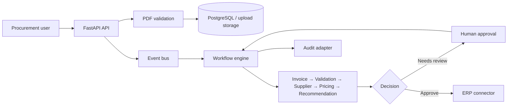

# Procurement AI Assistant

An event-driven FastAPI service that ingests supplier invoices, extracts structured data, evaluates validation/supplier/pricing signals, and produces an approval recommendation. It is built as a clean-architecture reference implementation with typed domain events, SQLAlchemy 2 persistence, a custom agent framework, and an explicit human approval checkpoint.

> **Current delivery status:** all fourteen project steps are represented in the repository. The service is suitable for local development and demonstration. Review the [production hardening notes](#production-hardening) before handling live procurement data.

## What it does

- Validates uploaded PDF invoices (file type, size, magic bytes, and scanner adapter).
- Parses PDF text and tables, then runs invoice, validation, supplier, pricing, and recommendation agents.
- Persists invoice-oriented data in PostgreSQL; supplier embeddings use pgvector.
- Publishes typed events through an in-memory bus or Redis Streams adapter.
- Pauses recommendations requiring review and resumes after a human APPROVE or REJECT decision.
- Exposes a versioned REST API with OpenAPI documentation at `/docs`.

## Architecture

The component and workflow design are documented in [docs/architecture.md](docs/architecture.md). At a glance:



## Quick start

### Docker Compose

1. Copy the example configuration and set a real API key if using an LLM provider.

   ```powershell
   Copy-Item .env.example .env
   ```

2. Start the application and backing services.

   ```powershell
   docker compose up --build
   ```

3. Open [http://localhost:8000/docs](http://localhost:8000/docs), or verify the service:

   ```powershell
   Invoke-RestMethod http://localhost:8000/api/v1/health
   ```

The Compose stack provides FastAPI (`8000`), PostgreSQL with pgvector (`5439`), Redis (`6379`), and Langfuse (`3000`).

### Local development

Requires Python 3.13+ and accessible PostgreSQL/Redis when using the default settings.

```powershell
python -m venv .venv
.\.venv\Scripts\Activate.ps1
python -m pip install --upgrade pip
python -m pip install -e ".[dev]"
Copy-Item .env.example .env
uvicorn src.main:app --reload
```

For an entirely local single-process event flow, set `EVENT_BUS_TYPE=memory` in `.env`. Database access still uses PostgreSQL unless `DATABASE_URL` is changed.

## API overview

All routes are prefixed with `/api/v1`.

| Method | Route                  | Purpose                                          |
| ------ | ---------------------- | ------------------------------------------------ |
| `GET`  | `/health`              | Service status and configured event bus          |
| `POST` | `/upload`              | Validate and submit a PDF invoice for processing |
| `GET`  | `/invoice/{id}`        | Retrieve invoice extraction and workflow status  |
| `GET`  | `/recommendation/{id}` | Retrieve the recommendation once available       |
| `POST` | `/approve`             | Submit a human APPROVE or REJECT decision        |
| `GET`  | `/audit/{id}`          | Retrieve audit records for an invoice            |

Protected routes accept `Authorization: Bearer <JWT>`. By default, the application requires a valid token for every protected route, and it refuses to silently fall back to a demo identity when the header is missing.

### Example workflow

```powershell
$file = Get-Item .\sample-invoice.pdf
$upload = Invoke-RestMethod -Method Post -Uri http://localhost:8000/api/v1/upload -Form @{ file = $file }
Invoke-RestMethod "http://localhost:8000/api/v1/invoice/$($upload.invoice_id)"
Invoke-RestMethod "http://localhost:8000/api/v1/recommendation/$($upload.invoice_id)"
```

If the recommendation is `NEEDS_HUMAN`, submit a decision:

```powershell
$body = @{
  invoice_id = $upload.invoice_id
  recommendation_id = "rec-$($upload.invoice_id)"
  action = "APPROVE"
  comments = "Reviewed by procurement"
} | ConvertTo-Json
Invoke-RestMethod -Method Post -Uri http://localhost:8000/api/v1/approve -ContentType 'application/json' -Body $body
```

## Configuration

Copy `.env.example` to `.env`; the most important settings are:

| Setting                                     | Purpose                                                             |
| ------------------------------------------- | ------------------------------------------------------------------- |
| `DATABASE_URL` or `POSTGRES_*`              | Async PostgreSQL connection settings                                |
| `EVENT_BUS_TYPE`                            | `memory` for local process execution, `redis` for the Redis adapter |
| `LLM_API_KEY`, `LLM_MODEL`, `LLM_BASE_URL`  | OpenRouter credentials, model, and API endpoint                     |
| `MAX_UPLOAD_SIZE_MB`, `ALLOWED_FILE_TYPES`  | Upload validation policy                                            |
| `SECRET_KEY`, `ACCESS_TOKEN_EXPIRE_MINUTES` | JWT signing and expiry                                              |
| `ENABLE_TELEMETRY`, `LANGFUSE_*`            | Telemetry configuration                                             |

Never commit `.env`, real API keys, or production signing keys. Rotate any secret that has been exposed.

## Tests and quality checks

The suite is hermetic: API tests override database and event-bus dependencies; agent tests use deterministic LLM fakes; repository tests use async in-memory SQLite. It covers domain models, schemas, security validation, JWTs, tools, agents, workflow branches, repositories, adapters, and API success/error paths.

```powershell
python -m pytest
python -m pytest --cov=src --cov-report=html
ruff check src tests
```

`pytest` is configured to report missing coverage and require known markers. The async SQLite driver used by repository tests is included in the `dev` dependency group.

## Project layout

```text
src/
  agents/          Custom framework and concrete procurement agents
  api/             FastAPI routes and dependency injection
  auth/            JWT and upload-security controls
  config/          Environment-backed settings
  domain/          Entities, value objects, and domain events
  events/          Event-bus ports and adapters
  infrastructure/  Database, LLM, and PDF adapters
  models/          SQLAlchemy ORM models
  repositories/    Persistence repositories
  schemas/         API and structured-output contracts
  tools/           Agent tool adapters
  workflows/       Event-driven orchestration and approval resume
tests/             Unit and isolated integration tests
docs/              Architecture and operational design notes
```

## Production hardening

Before a production deployment, complete the following controls:

- Require a valid JWT for all protected routes by default; allow local-only bypasses only when `REQUIRE_AUTHENTICATION=false` and you explicitly intend to disable it.
- Restrict CORS to approved origins from `CORS_ALLOW_ORIGINS` and source secrets from a managed secret store.
- Replace the mock ClamAV scanner and ERP/email/audit tools with authenticated production adapters.
- Persist workflow checkpoints and audit events transactionally; the current checkpoint store is process memory.
- Operate Redis Streams with consumer groups, idempotency keys, retries, dead-letter queues, and a worker process.
- Add Alembic migrations and backup/retention policies rather than relying on development `create_all`.
- Configure TLS, encrypted object storage, PII redaction, request limits, structured logs, metrics, alerts, and LLM spend controls.

## License

This project is licensed under the [MIT License](https://opensource.org/license/mit/).
