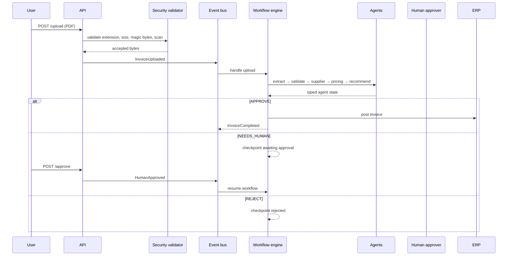

# Architecture and Operational Design

## Purpose and boundaries

Procurement AI Assistant processes invoice PDFs and produces an explainable procurement decision. It separates business concepts from transport, database, LLM, and external-system concerns so those adapters can be replaced without changing core workflow intent.

The current implementation is an application reference architecture: PostgreSQL, Redis, and Langfuse are containerized; agent tools and antivirus/ERP integrations are adapter stubs intended to be swapped for organization-specific services.

## Layered design

| Layer | Main packages | Responsibility |
| --- | --- | --- |
| Interface | `src/api`, `src/main` | HTTP contracts, dependencies, middleware, application lifecycle |
| Application | `src/workflows`, `src/agents`, `src/tools` | Orchestration, decision logic, agent execution, tool calls |
| Domain | `src/domain`, `src/schemas` | Invoice/supplier/recommendation concepts and typed events/contracts |
| Infrastructure | `src/infrastructure`, `src/events`, `src/models`, `src/repositories`, `src/telemetry` | Persistence, parsing, LLM, messaging, observability adapters |

Dependencies point inward: routes invoke application services; application logic relies on domain contracts and adapter interfaces; infrastructure implements those boundaries.

## Processing sequence

### States and events

The workflow checkpoints each successful phase with an `InvoiceStatus`. The primary events are `InvoiceUploaded`, `InvoiceParsed`, `InvoiceValidated`, `SupplierChecked`, `PricingCompleted`, `RecommendationCreated`, `HumanApproved`, and `InvoiceCompleted`.

`InMemoryEventBus` executes subscribers immediately and is the appropriate test/local choice. `RedisStreamsEventBus` records events in `events:<event_type>` streams and invokes subscribers in the current process. A durable, independently consuming Redis-worker topology is a required production extension, not a completed feature.

## Data architecture

- **PostgreSQL / SQLAlchemy 2:** invoices, line items, suppliers, purchase orders, recommendations, approvals, and audit logs.
- **pgvector:** supplier embedding column for future semantic similarity lookup.
- **Filesystem volume:** uploaded PDFs are stored under `storage/uploads` in the reference deployment.
- **Workflow checkpoint:** held in a `dict` by the current `WorkflowEngine` process. It is intentionally not a durable store yet.

The API writes the upload record before publishing its workflow event. Production deployments should use an outbox pattern or equivalent transaction/event coordination to prevent a committed invoice with a missed event.

## Security model

The upload service enforces extension allow-listing, byte size, a `%PDF-` header, and a scanner port. JWT utilities create and verify signed access tokens, and protected routes accept Bearer tokens.

The application currently permits a default demo user when no authorization header is supplied, and CORS is permissive. This supports the reference/demo flow but is not an acceptable production security posture. See the hardening checklist in the [README](../README.md#production-hardening).

## Reliability and observability

Agent execution follows a common typed `AgentState`/`AgentResult` contract with configurable retry policy. Tools are registered by name, run asynchronously, and emit telemetry. The LLM adapter requests structured Pydantic responses through LiteLLM; the document parser combines PyMuPDF text extraction with pdfplumber tables.

For production operations, instrument request IDs/correlation IDs end-to-end, persist checkpoints, make ERP posting idempotent, set retry/dead-letter policies, and alert on failed workflows, unsafe upload rejections, latency, queue lag, and LLM failures/cost.

## Deployment topology

`docker-compose.yml` runs the API, PostgreSQL/pgvector, Redis, and Langfuse as a local stack. The API container runs as a non-root user and mounts upload storage. Health is available at `GET /api/v1/health`.

Recommended production topology separates API and worker workloads, uses managed PostgreSQL/Redis/object storage, places the API behind TLS termination, and grants each service the least-privilege identity needed for its resources.
